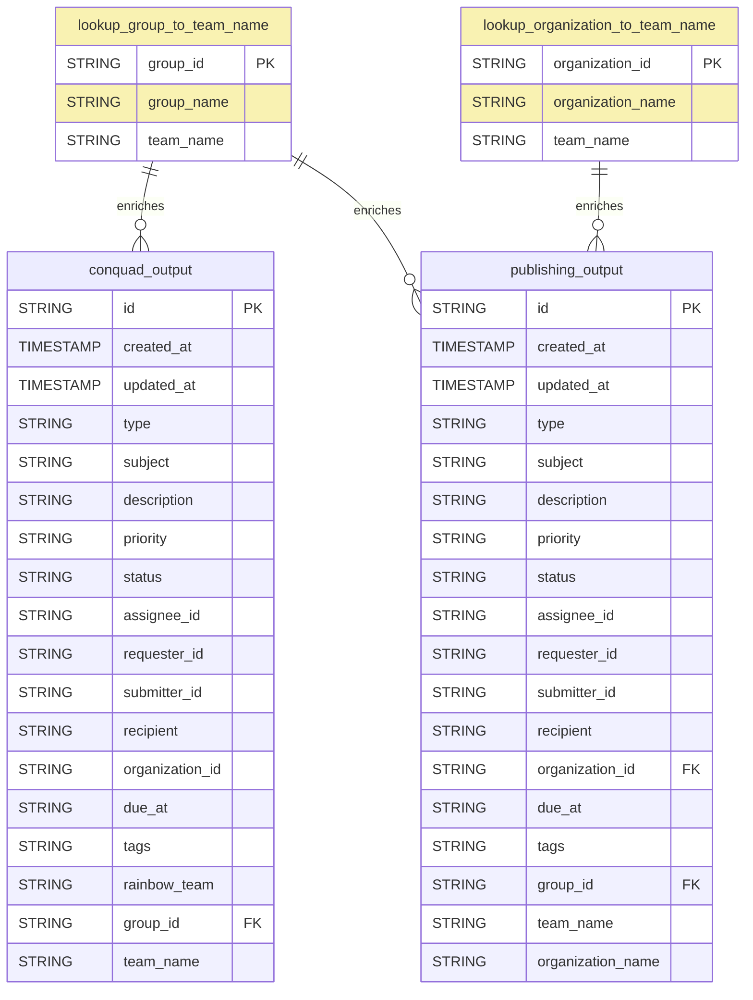

# GOV.UK Zendesk Dataform

The dataform configuration for modelling GOV.UK Zendesk ticket data. The dataform pipeline is in the `gds-bq-reporting` GCP project and processes Zendesk ticket data from the `govuk-knowledge-graph.zendesk` dataset.

The output tables provide team-specific views of Zendesk tickets for the Publishing team and ConQuaG team, with enriched metadata from lookup tables.

## Technical documentation

### Data Model

### Pipeline Overview

The pipeline processes Zendesk ticket data through several stages:

1. **Source Data** ([nested_zendesk_data.sqlx](definitions/sources/nested_zendesk_data.sqlx))
   - External declaration of tickets table from `govuk-knowledge-graph.zendesk.tickets`
   - Contains raw JSON ticket data with nested structures

2. **Processing Layer**
   - [flattened_zendesk_data.sqlx](definitions/processing/flattened_zendesk_data.sqlx): Extracts JSON fields into flat columns, filters to last 365 days
   - [converting_data_types.sqlx](definitions/processing/converting_data_types.sqlx): Casts fields to proper data types and converts tags array

3. **Lookup Tables**
   - [lookup_group_to_team_name.sqlx](definitions/lookups/lookup_group_to_team_name.sqlx): Maps Zendesk group IDs to group names and team names (Publishing, ConQuaG)
   - [lookup_organization_to_team_name.sqlx](definitions/lookups/lookup_organization_to_team_name.sqlx): Maps organization IDs to organization names and team names

4. **Output Tables**
   - [conquad_output.sqlx](definitions/outputs/conquad_output.sqlx): ConQuaG team view with rainbow team categorization based on ticket tags
   - [publishing_output.sqlx](definitions/outputs/publishing_output.sqlx): Publishing team view with organization names

### Key Features

#### Rainbow Team Classification (ConQuaG)
The ConQuaG output includes a `rainbow_team` field that categorizes tickets based on tags:
- Yellow team: `business_energy_immigration`
- Blue team: `working_justice_government`
- Green team: `tax_education`
- Red team: `transport_housing_health_environment`

#### Team Filtering
- ConQuaG output: Filters for `team_name = "ConQuaG"` and requires rainbow_team classification
- Publishing output: Filters for `team_name = "Publishing"`

### Development

#### Data Sources
- Source tickets are stored in `govuk-knowledge-graph.zendesk.tickets`
- Processing views and tables are created in the `gds-bq-reporting` project
- Data is filtered to the last 365 days of ticket updates

#### Lookup Table Maintenance
To add new groups or organizations:
1. Update the appropriate lookup table in [definitions/lookups/](definitions/lookups/)
2. Add new entries to the UNNEST array with group_id/organization_id, name, and team_name
3. Execute the workflow to update outputs

### Deployment
Once your PR is reviewed and approved, merge into `main`. The production release configuration will compile and execute the updated workflow.

### Note on Conquad Rainbow output 
- Modified the  uniquekey to be a composite of ["id","rainbow_team"] 
- as if a ticket has the tags for more then one rainbow team, we do want a row for each ticket. it does mean the ticket ID occurs more then once in the final output. 
However currently this is only an issue for 3 tickets, duplicated twice. 

## Licence

[MIT](LICENSE)
