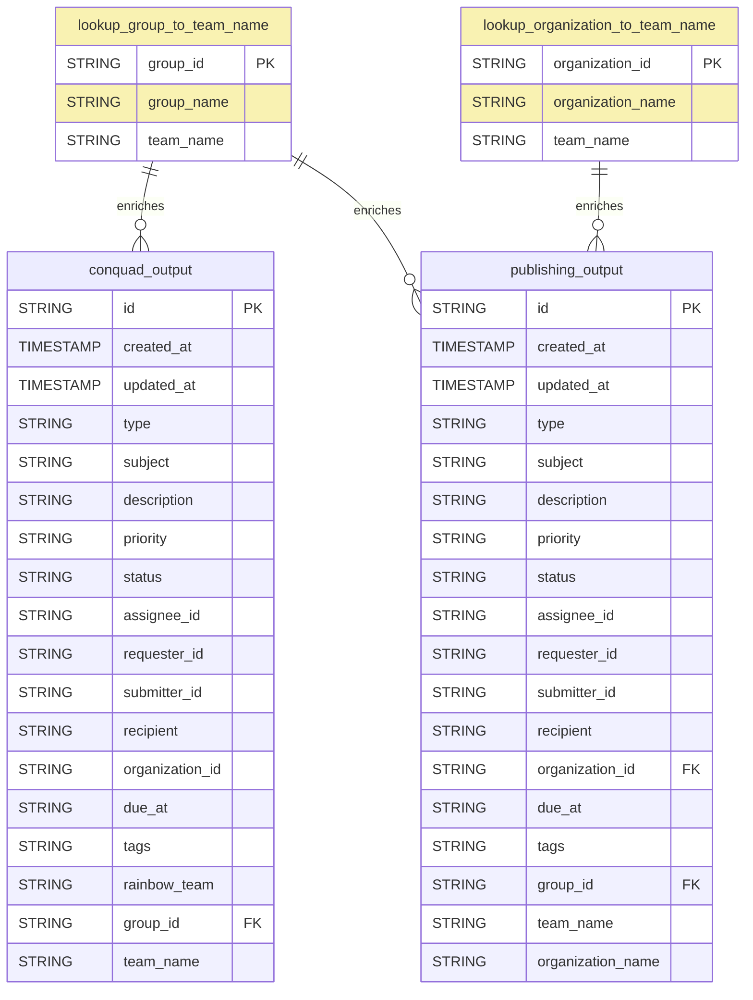

# GOV.UK Zendesk Dataform

The dataform configuration for modelling GOV.UK Zendesk ticket data. The dataform pipeline is in the `gds-bq-reporting` GCP project and processes Zendesk ticket data from the `govuk-knowledge-graph.zendesk` dataset.

The output tables provide team-specific views of Zendesk tickets for the Publishing team and ConQuaG team, with enriched metadata from lookup tables.

## Technical documentation

### Data Model



### Pipeline Overview

The pipeline processes Zendesk ticket data through several stages:

1. **Source Data** ([nested_zendesk_data.sqlx](definitions/sources/nested_zendesk_data.sqlx))
   - External declaration of tickets table from `govuk-knowledge-graph.zendesk.tickets`
   - Contains raw JSON ticket data with nested structures

2. **Processing Layer**
   - [flattened_zendesk_data.sqlx](definitions/processing/flattened_zendesk_data.sqlx): Extracts JSON fields into flat columns, filters to last 365 days
   - [converting_data_types.sqlx](definitions/processing/converting_data_types.sqlx): Casts fields to proper data types and converts tags array

3. **Lookup Tables**
   - [lookup_group_to_team_name.sqlx](definitions/lookups/lookup_group_to_team_name.sqlx): Maps Zendesk group IDs to group names and team names (Publishing, ConQuaG)
   - [lookup_organization_to_team_name.sqlx](definitions/lookups/lookup_organization_to_team_name.sqlx): Maps organization IDs to organization names and team names

4. **Output Tables**
   - [conquad_output.sqlx](definitions/outputs/conquad_output.sqlx): ConQuaG team view with rainbow team categorization based on ticket tags
   - [publishing_output.sqlx](definitions/outputs/publishing_output.sqlx): Publishing team view with organization names

### Key Features

#### Rainbow Team Classification (ConQuaG)
The ConQuaG output includes a `rainbow_team` field that categorizes tickets based on tags:
- Yellow team: `business_energy_immigration`
- Blue team: `working_justice_government`
- Green team: `tax_education`
- Red team: `transport_housing_health_environment`

#### Team Filtering
- ConQuaG output: Filters for `team_name = "ConQuaG"` and requires rainbow_team classification
- Publishing output: Filters for `team_name = "Publishing"`

### Development

#### Data Sources
- Source tickets are stored in `govuk-knowledge-graph.zendesk.tickets`
- Processing views and tables are created in the `gds-bq-reporting` project
- Data is filtered to the last 365 days of ticket updates

#### Lookup Table Maintenance
To add new groups or organizations:
1. Update the appropriate lookup table in [definitions/lookups/](definitions/lookups/)
2. Add new entries to the UNNEST array with group_id/organization_id, name, and team_name
3. Execute the workflow to update outputs

### Deployment
Once your PR is reviewed and approved, merge into `main`. The production release configuration will compile and execute the updated workflow.

### Note on Conquad Rainbow output 
- Modified the  uniquekey to be a composite of ["id","rainbow_team"] 
- as if a ticket has the tags for more then one rainbow team, we do want a row for each ticket. it does mean the ticket ID occurs more then once in the final output. 
However currently this is only an issue for 3 tickets, duplicated twice. 


## Youtube BQ short or long function
This helper function exists to check if a youtube video id is a short or a long

Endpoint: https://console.cloud.google.com/run/detail/europe-west2/bq-youtube-short-or-long/source?project=gds-social-data

Connector: yt-short-checker-conn projects/gds-social-data/locations/europe-west2/connections/yt-short-checker-conn

connector service account:bqcx-1031179907628-b88w@gcp-sa-bigquery-condel.iam.gserviceaccount.com

BQ routine: bq_youtube_short_or_long https://console.cloud.google.com/bigquery?project=gds-social-data&ws=!1m6!1m5!6m3!1sgds-social-data!2sdataform_youtube_processing!3sbq_youtube_short_or_long!23sTREE_NODE_SELECTION

BQ routine source code: 

```
CREATE OR REPLACE FUNCTION
	`gds-social-data.dataform_youtube_processing.bq_youtube_short_or_long`(video_id STRING) RETURNS STRING
REMOTE WITH CONNECTION `gds-social-data.europe-west2.yt-short-checker-conn`
OPTIONS (endpoint = 'https://bq-youtube-short-or-long-1031179907628.europe-west2.run.app', max_batching_rows = 10);
```
Cloud Function configuration 

- Startup CPU boost: Enabled
- Concurrency: 8
- Request timeout: 300 seconds
- Execution environment: Second generation

Revision
- max. instances: 100
- Auto-scaling factors
- Default auto-scaling factors
-  Image
europe-west2-docker.pkg.dev/gds-social-data/cloud-run-source-deploy/bq-youtube-short-or-long@sha256:2cae90ffc7190ec5b15d031eca85d6ebc85a00c8f78a24c2f0064c65314eb9c5 
- Base image
europe-west2-docker.pkg.dev/serverless-runtimes/google-24/runtimes/python314 
- Base image update: Automatic
- Port: 8080

Build
- CPU limit: 1
- Memory limit: 512MiB

- requirements.txt
functions-framework==3.*
requests==2.31.0

```python
import functions_framework
import requests
from concurrent.futures import ThreadPoolExecutor

# Global session for connection pooling across warm starts
session = requests.Session()
# Increase the pool size to match our worker count
adapter = requests.adapters.HTTPAdapter(pool_connections=50, pool_maxsize=50)
session.mount('https://', adapter)

def check_video(video_id):
    if not video_id:
        return None
    
    url = f"https://www.youtube.com/shorts/{video_id}"
    try:
        # HEAD request with a strict timeout to prevent one slow video from 
        # hanging the whole BigQuery batch
        response = session.head(url, allow_redirects=False, timeout=3.5)
        
        if response.status_code == 303:
            return "Long"
        elif response.status_code == 200:
            return "Short"
        else:
            return f"Unknown ({response.status_code})"
    except Exception:
        return "Error"

@functions_framework.http
def youtube_type_checker(request):
    request_json = request.get_json(silent=True)
    calls = request_json.get('calls', [])
    
    # Process exactly the batch BigQuery sent (ideally 50)
    with ThreadPoolExecutor(max_workers=50) as executor:
        # Maintain order for BigQuery
        replies = list(executor.map(lambda x: check_video(x[0]), calls))

    return {"replies": replies}

```

## Licence

[MIT](LICENSE)
